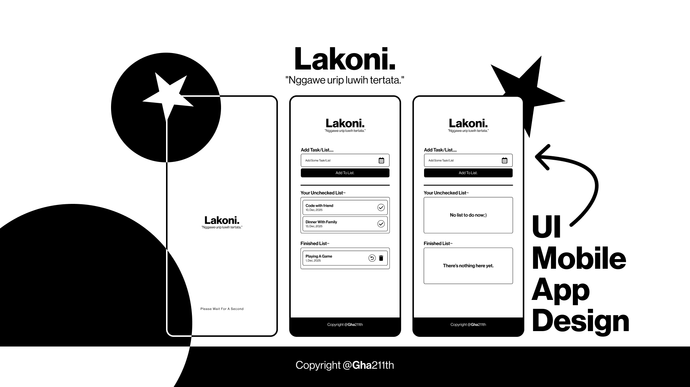

# Lakoni 🎭

A lightweight, experimental application built for exploration and fun.

## 🌟 Overview

**Lakoni** is a passion project developed to explore new technologies and experiment with application logic. The name itself reflects the journey of "doing" or "acting out" a process—focusing more on the development experience and learning curve rather than being a commercial-ready product.

> [!IMPORTANT]
> **Note:** This project is created strictly **'just for fun'**. It is a playground for testing ideas, and while it is functional, it is not intended for production use.

## 🚀 Features

* **Clean Architecture:** Built with a focus on modularity and readable code.
* **Experimental UI:** Testing out unique design patterns and user flows.
* **Lightweight & Fast:** Minimal overhead for a smooth experience.

## 🛠️ Tech Stack

* **Framework:** [Flutter](https://flutter.dev) / [Dart](https://dart.dev)
* **Database:** Sqflite
* **Editor:** Visual Studio Code

## 📦 Installation

Since this is a fun project, you can clone and run it locally:

```bash
# Clone the repository
git clone [https://github.com/Gha211th/Lakoni.git](https://github.com/Gha211th/Lakoni.git)

# Navigate to the project directory
cd Lakoni

# Get dependencies
flutter pub get

# Run the app
flutter run
